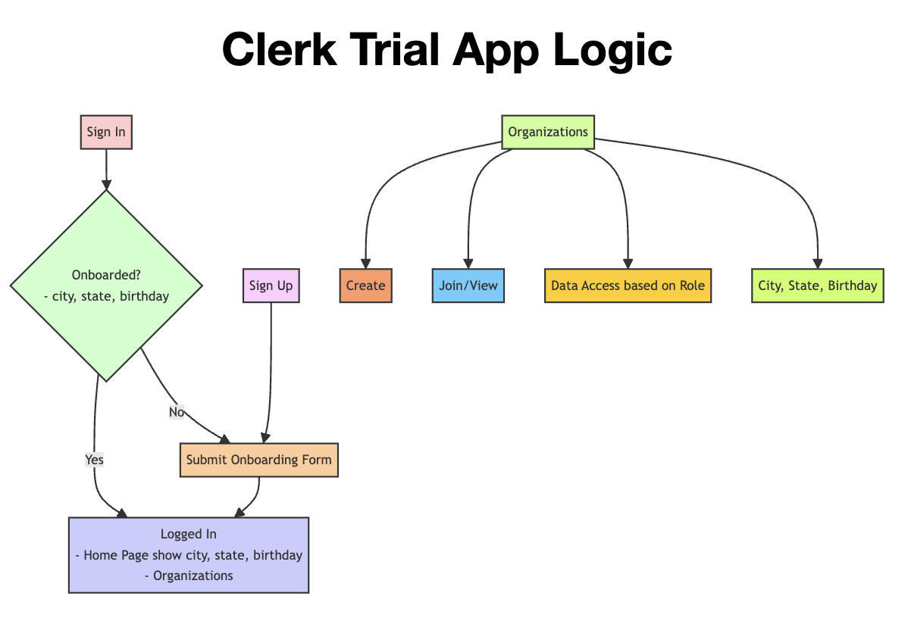

# Clerk Trial Project

This project is a organizational management tool built with Next.js and Clerk for user authentication.   
It demonstrates the use of Clerk's authentication features and components, public metadata, dynamic routing, and protected routes.

<p align="center">
  
</p>

## Table of Contents
- [Clerk Trial Project](#clerk-trial-project)
  - [Table of Contents](#table-of-contents)
- [Installation](#installation)
- [Overview](#overview)
  - [How Does It Work?](#how-does-it-work)
  - [What Does It Do?](#what-does-it-do)
  - [Clerk Features / API Used](#clerk-features--api-used)
  - [Approach to the Problem](#approach-to-the-problem)
  - [Future Extensions](#future-extensions)

# Installation

1. Clone the repository:
   ```bash
   git clone https://github.com/sun2ii/clerk-trial.git
   cd clerk-trial
   ```
2. Run the app & open localhost:3000
   ```bash
   npm run dev 
   # open https://localhost:3000 on local browser
   ```
# Overview

## How Does It Work?
This application is a simple organizational management tool built with Next.js and Clerk for user authentication from a mock company called HumbleHR.

## What Does It Do?

-  **Authentication** - Users sign up and log in using Clerk’s authentication features.
- **Onboarding** - Before users are fully signed up, they are required to enter their City, State, and Birthday.
- **Homepage & Organization Profiles** - Once sign-up is complete, users are taken to a simple page that showcases the organizations they belong to, along with their role, city, state, and birthday. Each organization has its own profile (`<OrganizationProfile>`) and uses Next.js dynamic routing for access.

## Clerk Features / API Used
- **Authentication Components**: `<SignUpButton>`, `<SignInButton>`, `<SignedOut>`, `<SignedIn>`, `<ClerkProvider>`
- **Clerk UI Components**: `<UserButton>`, `<OrganizationList>`, `<OrganizationProfile>`, `<OrganizationProfile.Page>`, `<Protect>`
- **API Used**: `clerkClient.users.updateUser()` for onboarding. A custom form on the frontend captures this information.


## Approach to the Problem
1. **Setup**: Initialized the Next.js application and integrated Clerk for authentication.
2. **Research**: Explored Clerk’s blogs, documentation, GitHub, and Discord channels to gather insights for implementation.
3. **Architect/Diagram**: Designed and diagrammed the desired workflow and application flow.
4. **Implementation**: Developed the application based on the planned architecture.
5. **Documentation**: Documented the entire process and implementation details in the README file upon completion.

## Future Extensions
- **Enhanced User Roles and Permissions**: Implement a more detailed user role system where different roles have varying levels of access and permissions within the application. This would involve using Clerk’s roles and permissions features more extensively.
- **Advanced Data Management**: Integrate a more comprehensive backend system, possibly using a database like Supabase or Neon, to handle more complex queries and data relationships. This would support features such as filtering, sorting, and searching organizations based on various criteria.
- **Enable Google Analytics for Clerk**: Track user interactions, analyze engagement, and better understand user demographics.