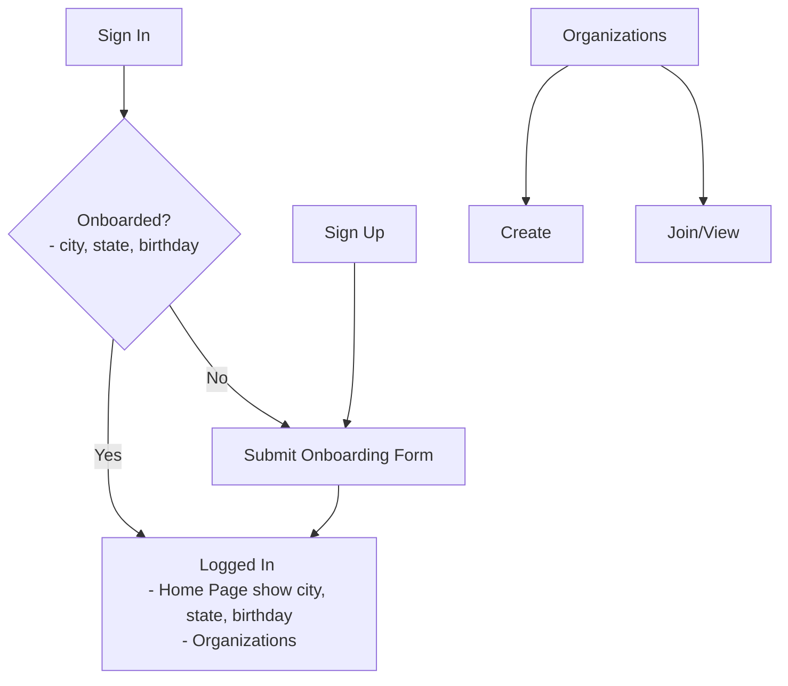

```mermaid 
graph TD
    %% Login Flow 
    A[Sign In] --> O{Onboarded?\n- city, state, birthday}
    O --> |Yes|L[Logged In \n- Home Page show city, state, birthday\n- Organizations]
    O --> |No|C[Submit Onboarding Form]
    C --> L
    B[Sign Up] --> C

  %% Organization Flow
    I[Organizations] --> J[Create]
    I --> K[Join/View]


    %% B --> C[Showcase Organization List]
```
