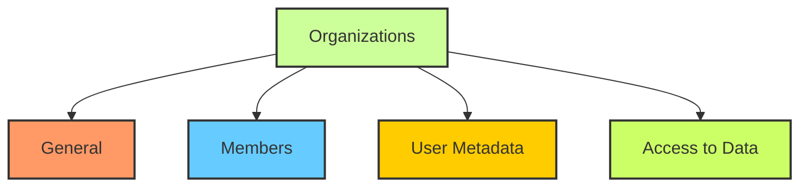

<h1>Architecture</h1>

```mermaid 
graph TD
    %% Login Flow 
    %% A[Sign In] --> O{Onboarded?\n- city, state, birthday}
    %% O --> |Yes|L[Logged In \n- Home Page show city, state, birthday\n- Organizations]
    %% O --> |No|C[Submit Onboarding Form]
    %% C --> L
    %% B[Sign Up] --> C

  %% %% Organization Flow
    I[Organizations] --> J[General]
    I --> K[Members]
    I --> M[User Metadata]
    I --> N[Access to Data]

    %% style A fill:#ccffcc,stroke:#333,stroke-width:2px
    %% style O fill:#ccffcc,stroke:#333,stroke-width:2px
    %% style L fill:#ccccff,stroke:#333,stroke-width:2px
    %% style C fill:#ffcc99,stroke:#333,stroke-width:2px
    %% style B fill:#ccffcc,stroke:#333,stroke-width:2px
    style I fill:#ccff99,stroke:#333,stroke-width:2px
    style J fill:#ff9966,stroke:#333,stroke-width:2px
    style K fill:#66ccff,stroke:#333,stroke-width:2px
    style M fill:#ffcc00,stroke:#333,stroke-width:2px
    style N fill:#ccff66,stroke:#333,stroke-width:2px
```
