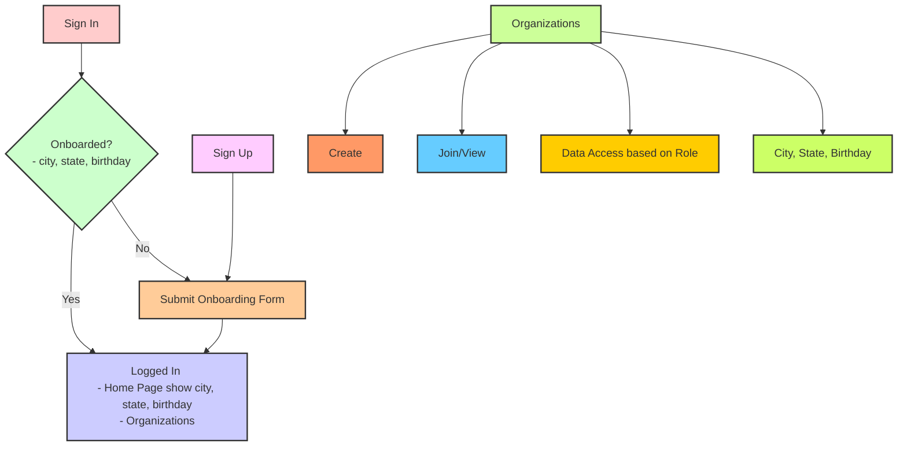

<h1>Clerk Trial App Logic</h1>

```mermaid 
graph TD
    %% Login Flow 
    A[Sign In] --> O{Onboarded?\n- city, state, birthday}
    O --> |Yes|L[Logged In \n- Home Page show city, state, birthday\n- Organizations]
    O --> |No|C[Submit Onboarding Form]
    C --> L
    B[Sign Up] --> C

  %% Organization Flow
    I[Organizations] --> J[Create]
    I --> K[Join/View]
    I --> M[Data Access based on Role]
    I --> N[City, State, Birthday]


    style A fill:#ffcccc,stroke:#333,stroke-width:2px
    style O fill:#ccffcc,stroke:#333,stroke-width:2px
    style L fill:#ccccff,stroke:#333,stroke-width:2px
    style C fill:#ffcc99,stroke:#333,stroke-width:2px
    style B fill:#ffccff,stroke:#333,stroke-width:2px
    style I fill:#ccff99,stroke:#333,stroke-width:2px
    style J fill:#ff9966,stroke:#333,stroke-width:2px
    style K fill:#66ccff,stroke:#333,stroke-width:2px
    style M fill:#ffcc00,stroke:#333,stroke-width:2px
    style N fill:#ccff66,stroke:#333,stroke-width:2px
```
