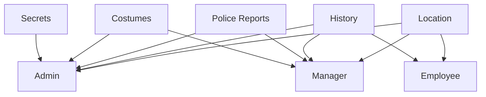

<h1>Spiderman Data Access</h1>

```mermaid
graph TD
    A[Secrets] --> Admin
    B[Costumes] --> Admin
    C[Police Reports] --> Admin
    D[History] --> Admin
    E[Location] --> Admin

    B --> Manager
    C --> Manager
    D --> Manager
    E --> Manager

    D --> Employee
    E --> Employee

    %% style B fill:#f9f,stroke:#333,stroke-width:2px
    %% style C fill:#bbf,stroke:#333,stroke-width:2px
    %% style D fill:#bfb,stroke:#333,stroke-width:2px
    %% style E fill:#fbf,stroke:#333,stroke-width:2px
    %% style F fill:#ffb,stroke:#333,stroke-width:2px
```

